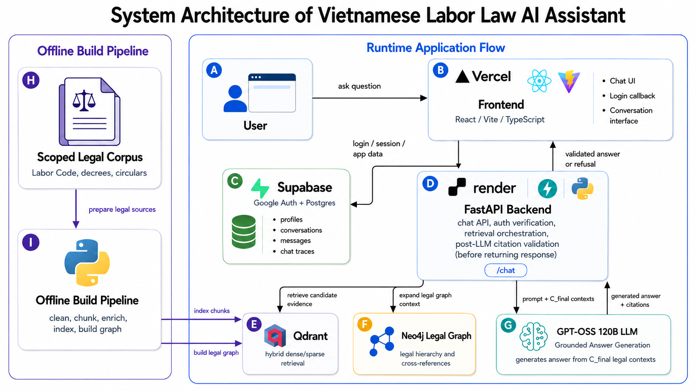
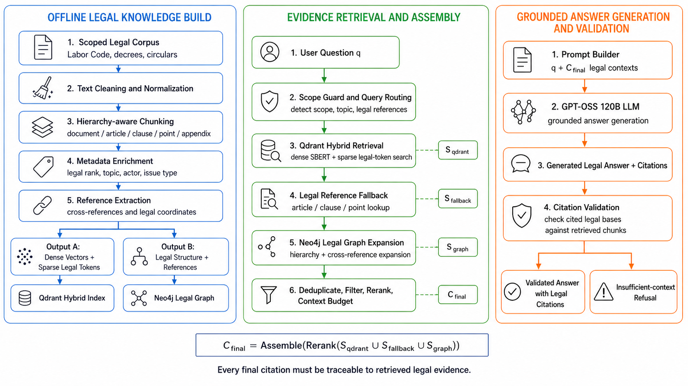

# Vietnamese Labor Law AI Assistant

Vietnamese Labor Law AI Assistant is a scoped legal information system for question answering over a fixed Vietnamese labor-law corpus. It combines hierarchy-aware corpus preparation, Qdrant hybrid retrieval, optional Neo4j legal graph expansion, grounded answer generation, and deterministic citation validation before a response is returned.

This project is not a legal advice tool. It is designed to help users locate and assemble legal evidence from the indexed corpus, not to replace professional legal counsel.

## Table of Contents

- [Quick Start](#quick-start)
- [What the system does](#what-the-system-does)
- [System Architecture](#system-architecture)
- [System Pipeline](#system-pipeline)
- [Corpus Scope](#corpus-scope)
- [Demo](#demo)
- [Tech Stack](#tech-stack)
- [Repository Structure](#repository-structure)
- [Detailed Setup](#detailed-setup)
- [Core Commands](#core-commands)
- [Evaluation](#evaluation)
- [Testing](#testing)
- [Related Documentation](#related-documentation)
- [Limitations](#limitations)

## Quick Start

### 1. Install backend dependencies

```powershell
python -m venv .venv
.venv\Scripts\python.exe -m pip install --upgrade pip
.venv\Scripts\python.exe -m pip install -e ".[dev]"
```

### 2. Configure environment variables

- Copy `.env.example` to `.env`.
- Copy `frontend/.env.example` to `frontend/.env` if you want to run the web UI locally.
- Fill in at least the Qdrant, LLM provider, and auth settings you need for your environment.

### 3. Start the services

Optional Neo4j service:

```powershell
docker compose -f docker-compose.neo4j.yml up -d
```

Backend:

```powershell
.venv\Scripts\python.exe -m uvicorn vn_labor_law_ai_assistant.api:app --reload --host 0.0.0.0 --port 8000
```

Frontend:

```powershell
cd frontend
npm install
npm run dev
```

Default local URLs:

- Frontend: `http://localhost:5173`
- Backend API: `http://localhost:8000`
- Backend docs: `http://localhost:8000/docs`

## What the system does

- Answers Vietnamese labor-law questions from a bounded six-document corpus.
- Preserves legal structure at document, article, clause, point, and appendix level.
- Uses hybrid dense+sparse retrieval in Qdrant.
- Expands evidence through a legal knowledge graph in Neo4j when graph mode is enabled.
- Applies scope guard and routing logic before answer generation.
- Validates cited legal bases against retrieved evidence before returning an answer.
- Supports local development with FastAPI + SQLite and production-oriented auth/app data flows with Supabase.

## System Architecture



The current codebase maps to this architecture as follows:

- `frontend/` contains the React + Vite + TypeScript web client.
- `src/vn_labor_law_ai_assistant/api/` exposes FastAPI routes for health, auth, chat, conversations, and admin flows.
- `src/vn_labor_law_ai_assistant/rag/retrieval/` orchestrates Qdrant retrieval, fallback lookup, reranking, and context assembly.
- `src/vn_labor_law_ai_assistant/rag/graph/` builds and queries the legal graph used for expansion.
- `src/vn_labor_law_ai_assistant/rag/answering/` handles prompt building, answer synthesis, validation, formatting, and overrides.
- `src/vn_labor_law_ai_assistant/rules/` stores routing and answer override rules.
- `supabase/` contains SQL migrations for production app data.

Note: the diagram above comes from the report draft and reflects one deployment snapshot. In the codebase, the LLM provider, auth mode, app data backend, and legal graph usage are configurable through environment variables.

## System Pipeline



The project is organized around three stages:

1. Offline legal knowledge build: validate curated texts, normalize content, chunk legal units, enrich metadata, and extract references.
2. Evidence retrieval and assembly: apply scope guard and routing, retrieve hybrid seed evidence from Qdrant, add legal-reference fallback hits, optionally expand through Neo4j, then deduplicate and budget final context.
3. Grounded answer generation and validation: build the final prompt from retrieved context, generate an answer, and validate every cited legal basis against retrieved chunks before returning either a grounded answer or an insufficient-context refusal.

The final context assembly used across the retrieval stack is:

```text
C_final = Assemble(Rerank(S_qdrant U S_fallback U S_graph))
```

## Corpus Scope

The official corpus is intentionally scoped to these six document groups:

| Document ID | Document |
| --- | --- |
| `45-2019-qh14` | Labor Code 2019 |
| `92-2015-qh13-labor-only` | Civil Procedure Code 2015, labor-only subset |
| `nghi-dinh-135-2020-nd-cp` | Decree 135/2020/ND-CP |
| `nghi-dinh-145-2020-nd-cp` | Decree 145/2020/ND-CP |
| `thong-tu-09-2020-tt-bldtbxh` | Circular 09/2020/TT-BLDTBXH |
| `thong-tu-10-2020-tt-bldtbxh` | Circular 10/2020/TT-BLDTBXH |

Questions outside this indexed corpus should produce an insufficient-context response instead of unsupported legal conclusions.

## Demo

Demo section is reserved for the upcoming product walkthrough video.

Planned demo content:

- End-to-end question answering flow from the web UI.
- In-corpus grounded answer with legal citations.
- Out-of-corpus insufficient-context refusal behavior.
- Retrieval and citation validation traceability.

Video link will be added here later.

## Tech Stack

**Application Layer**


**Retrieval and Knowledge Layer**


**Data and Auth**


**Ops and Tooling**


## Repository Structure

```text
artifacts/        Generated chunks, indexes, graph summaries, and evaluation outputs
corpus/           Raw, cleaned, and curated legal source texts
docs/             Architecture and reproducibility notes
frontend/         React + Vite + TypeScript web client
my-embedding-api/ Optional helper service for embedding API experiments
report/           Report sources and project figures
scripts/          Corpus, indexing, graph, QA, and evaluation commands
src/              Python backend package
supabase/         SQL migrations for Supabase-backed app data
tests/            Unit and integration-style tests
```

## Detailed Setup

### 1. Install backend dependencies

```powershell
python -m venv .venv
.venv\Scripts\python.exe -m pip install --upgrade pip
.venv\Scripts\python.exe -m pip install -e ".[dev]"
```

### 2. Configure environment variables

Copy `.env.example` to `.env` and fill in the values you need.

Important backend settings:

- `LLM_PROVIDER`, `GROQ_API_KEY`, `GROQ_MODEL`: runtime answer generation provider.
- `QUERY_ROUTER_ENABLED`, `QUERY_ROUTER_MODEL`: query routing and scope behavior.
- `QDRANT_URL`, `QDRANT_API_KEY`, `QDRANT_COLLECTION`: retrieval backend.
- `LEGAL_GRAPH_ENABLED`, `NEO4J_URI`, `NEO4J_USER`, `NEO4J_PASSWORD`: legal graph expansion.
- `APP_DATA_BACKEND`, `AUTH_PROVIDER`, `AUTH_SECRET`: local or production auth/data mode.

Frontend settings live in `frontend/.env.example`:

- `VITE_SUPABASE_URL`
- `VITE_SUPABASE_ANON_KEY`
- `VITE_API_BASE_URL`

### 3. Start optional Neo4j service

Neo4j is only required when legal graph expansion is enabled.

```powershell
docker compose -f docker-compose.neo4j.yml up -d
```

### 4. Start the backend

```powershell
.venv\Scripts\python.exe -m uvicorn vn_labor_law_ai_assistant.api:app --reload --host 0.0.0.0 --port 8000
```

Default backend URLs:

- API: `http://localhost:8000`
- Docs: `http://localhost:8000/docs`

### 5. Start the frontend

```powershell
cd frontend
npm install
npm run dev
```

Default frontend URL:

- App: `http://localhost:5173`

## Core Commands

### Ask a question from the CLI

Retrieve context only:

```powershell
.venv\Scripts\python.exe scripts\ask.py --retrieve-only "Hop dong lao dong can co nhung noi dung gi?"
```

Generate an answer with the configured provider:

```powershell
.venv\Scripts\python.exe scripts\ask.py --provider groq --model qwen/qwen3-32b "Hop dong lao dong can co nhung noi dung gi?"
```

### Rebuild the legal knowledge pipeline

Validate curated text:

```powershell
.venv\Scripts\python.exe scripts\validate_curated_legal_texts.py
```

Build legal chunks:

```powershell
.venv\Scripts\python.exe scripts\build_legal_chunks.py
```

Enrich chunk metadata:

```powershell
.venv\Scripts\python.exe scripts\enrich_legal_chunks.py
```

Build cross-reference edges:

```powershell
.venv\Scripts\python.exe scripts\build_reference_edges.py
```

Build the Qdrant index:

```powershell
.venv\Scripts\python.exe scripts\build_index.py `
  --chunk-file artifacts\chunks\legal_chunks_enriched.jsonl `
  --collection-name vietnamese_labor_law_chunks
```

Build the legal graph:

```powershell
.venv\Scripts\python.exe scripts\build_legal_graph.py `
  --index-path artifacts\index `
  --chunks-path artifacts\chunks\legal_chunks_enriched.jsonl `
  --reference-edges-path artifacts\graph\reference_edges.jsonl `
  --reset
```

See [docs/REPRODUCIBILITY.md](docs/REPRODUCIBILITY.md) for the longer rebuild flow.

## Evaluation

The project includes deterministic evaluation scripts for the scoped 100-query benchmark. The main reported metrics include:

- Recall@10
- Required Citation Coverage
- Forbidden Citation Violation Rate
- Adjusted end-to-end pass rate
- Answer pass rate
- Citation validation pass rate
- Quality validation pass rate
- Out-of-corpus QA pass rate

Run retrieval ablation:

```powershell
.venv\Scripts\python.exe scripts\ablation_retrieval_100.py `
  --benchmark-path artifacts\evaluation\golden_benchmark_100_extended.jsonl `
  --output-prefix ablation_retrieval_100_final_candidate
```

Run deterministic end-to-end evaluation:

```powershell
.venv\Scripts\python.exe scripts\evaluate_end_to_end_rag.py `
  --benchmark-path artifacts\evaluation\golden_benchmark_100_extended.jsonl `
  --output-prefix end_to_end_100_final_candidate
```

## Testing

Backend checks:

```powershell
.venv\Scripts\ruff.exe check .
.venv\Scripts\mypy.exe src/vn_labor_law_ai_assistant/core src/vn_labor_law_ai_assistant/api src/vn_labor_law_ai_assistant/auth src/vn_labor_law_ai_assistant/db
.venv\Scripts\python.exe -m unittest discover -s tests -v
```

Frontend checks:

```powershell
cd frontend
npm install
npm run build
```

## Related Documentation

- [docs/ARCHITECTURE.md](docs/ARCHITECTURE.md)
- [docs/REPRODUCIBILITY.md](docs/REPRODUCIBILITY.md)
- [report/README.md](report/README.md)

## Limitations

- The assistant is limited to the six indexed document groups listed above.
- It provides legal information from retrieved evidence, not professional legal advice.
- Citation validation checks grounding against retrieved context, not full legal correctness.
- Questions about newer regulations, amendments, or external laws require corpus and index updates before the system can answer safely.
- When graph expansion is disabled, retrieval relies only on the Qdrant and fallback stages.
