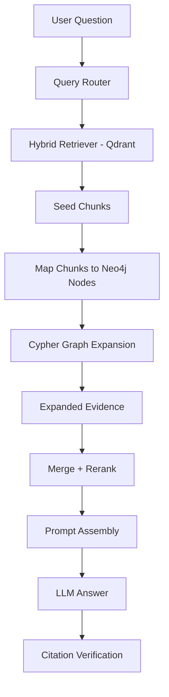

# Implementation Plan: Legal Graph-Augmented RAG with Neo4j

## 0. Goal

Mục tiêu của task này là mở rộng hệ thống **Vietnamese Labor Law AI Assistant** từ Hybrid RAG hiện tại thành **Legal Graph-Augmented RAG sử dụng Neo4j làm graph database chính**.

Định hướng phục vụ thesis/report:

- Qdrant tiếp tục là **Vector DB / Hybrid Retrieval backend**.
- Neo4j là **Legal Knowledge Graph backend chính**.
- Graph không thay thế RAG hiện tại, mà đóng vai trò **legal evidence expansion layer**.
- Hệ thống cần có Cypher traversal, graph visualization, provenance và evaluation để trình bày trong thesis.

---

## 1. Final Target Architecture

```text
Raw / cleaned legal documents
   |
   v
Corpus builder
   |
   v
Chunking + legal metadata
   |
   +-----------------------------+
   |                             |
   v                             v
Qdrant hybrid index          Neo4j Legal Graph
Dense + sparse vectors       Nodes + edges + provenance
   |                             |
   +-------------+---------------+
                 |
                 v
User query
   |
   v
Query routing
   |
   v
Hybrid retrieval from Qdrant
   |
   v
Seed chunks / seed legal units
   |
   v
Map seed chunks to Neo4j nodes
   |
   v
Cypher-based legal graph expansion
   |
   v
Expanded legal evidence
   |
   v
Merge + deduplicate
   |
   v
Heuristic rerank + semantic rerank
   |
   v
Context assembly with citation metadata
   |
   v
LLM answer generation
   |
   v
Citation / grounding verification
```

---

## 2. Why Neo4j Is Required for Thesis

Neo4j should be used as the main graph backend because it helps the thesis in four ways:

1. **Clear graph representation**  
   Legal relations such as `Article -> Clause -> Condition -> Consequence` can be visualized directly.

2. **Cypher traversal is explainable**  
   The thesis can show concrete graph queries such as:

   ```cypher
   MATCH path = (c:Evidence_Chunk {chunk_id: $chunk_id})-[:SOURCE_OF|HAS_SOURCE_CHUNK|MENTIONS_CONCEPT|REFERENCES*1..2]-(n)
   RETURN path
   LIMIT 20
   ```

3. **Better demonstration for legal reasoning**  
   Multi-hop legal evidence retrieval can be explained through paths.

4. **Better screenshots/figures for report**  
   Neo4j Browser/Bloom visualization can be used in the thesis to show ontology and traversal examples.

Therefore, this plan treats Neo4j as **mandatory**, not optional.

---

## 3. Design Principles

1. **Qdrant remains the primary semantic/hybrid retriever.**  
   Neo4j does not replace vector search.

2. **Neo4j is the primary graph database.**  
   SQLite graph storage is not part of the main thesis implementation.

3. **Rule-based graph construction first.**  
   Structural legal relations must be deterministic.

4. **LLM extraction is optional and validated.**  
   LLM-generated edges must include source quote, confidence, and provenance.

5. **Every graph relation must be traceable.**  
   Each node/edge must store `source_chunk_id`, `citation_text`, `extraction_method`, and `confidence`.

6. **Graph expansion must be measurable.**  
   The evaluation must compare Hybrid RAG vs Hybrid RAG + Neo4j graph expansion.

---

# Phase 1 — Neo4j Environment Setup

## Goal

Set up Neo4j as the required graph backend for development, thesis experiments, and visualization.

## Tasks

### 1.1 Add Neo4j Docker Compose service

Create or update:

```text
docker-compose.neo4j.yml
```

Example:

```yaml
services:
  neo4j:
    image: neo4j:5
    container_name: labor-law-neo4j
    ports:
      - "7474:7474"
      - "7687:7687"
    environment:
      NEO4J_AUTH: neo4j/password
      NEO4J_PLUGINS: '["apoc"]'
    volumes:
      - neo4j_data:/data
      - neo4j_logs:/logs
      - neo4j_import:/var/lib/neo4j/import
      - neo4j_plugins:/plugins

volumes:
  neo4j_data:
  neo4j_logs:
  neo4j_import:
  neo4j_plugins:
```

### 1.2 Add environment variables

Add to `.env.example`:

```env
LEGAL_GRAPH_ENABLED=false
LEGAL_GRAPH_BACKEND=neo4j

NEO4J_URI=bolt://localhost:7687
NEO4J_USER=neo4j
NEO4J_PASSWORD=password
NEO4J_DATABASE=neo4j

LEGAL_GRAPH_EXPANSION_DEPTH=2
LEGAL_GRAPH_MAX_EXPANDED_CHUNKS=12
LEGAL_GRAPH_MIN_CONFIDENCE=0.60
LEGAL_GRAPH_COMPLEX_QUERY_ONLY=true
LEGAL_GRAPH_TRACE=false
```

### 1.3 Add dependencies

Update project dependencies:

```text
neo4j
```

Optional:

```text
pydantic
```

if stricter graph config models are needed.

## Acceptance Criteria

- Neo4j runs locally with Docker.
- Neo4j Browser is available at `http://localhost:7474`.
- Python backend can connect to Neo4j using Bolt.
- Environment variables control graph retrieval.

---

# Phase 2 — Define Legal Graph Ontology

## Goal

Define the official schema for the Legal Knowledge Graph.

## Files

```text
src/vn_labor_law_ai_assistant/rag/graph/
    __init__.py
    ontology.py
    models.py
    config.py
```

## Node Types

Create `ontology.py`:

```python
class NodeType(str, Enum):
    LEGAL_DOCUMENT = "Legal_Document"
    LEGAL_CHAPTER = "Legal_Chapter"
    LEGAL_SECTION = "Legal_Section"
    LEGAL_ARTICLE = "Legal_Article"
    LEGAL_CLAUSE = "Legal_Clause"
    LEGAL_POINT = "Legal_Point"
    LEGAL_RULE = "Legal_Rule"

    SUBJECT = "Subject"
    LEGAL_CONCEPT = "Legal_Concept"
    ACTION = "Action"
    CONDITION = "Condition"
    EXCEPTION = "Exception"
    RIGHT = "Right"
    OBLIGATION = "Obligation"
    CONSEQUENCE = "Consequence"
    SANCTION = "Sanction"
    DEADLINE = "Deadline"
    FORMULA = "Formula"
    PROCEDURE = "Procedure"

    EVIDENCE_CHUNK = "Evidence_Chunk"
```

## Edge Types

```python
class EdgeType(str, Enum):
    HAS_CHAPTER = "HAS_CHAPTER"
    HAS_SECTION = "HAS_SECTION"
    HAS_ARTICLE = "HAS_ARTICLE"
    HAS_CLAUSE = "HAS_CLAUSE"
    HAS_POINT = "HAS_POINT"
    HAS_SOURCE_CHUNK = "HAS_SOURCE_CHUNK"
    SOURCE_OF = "SOURCE_OF"

    REFERENCES = "REFERENCES"
    GUIDED_BY = "GUIDED_BY"
    DETAILS = "DETAILS"
    AMENDS = "AMENDS"
    REPLACES = "REPLACES"

    APPLIES_TO = "APPLIES_TO"
    MENTIONS_CONCEPT = "MENTIONS_CONCEPT"
    REGULATES_ACTION = "REGULATES_ACTION"
    HAS_CONDITION = "HAS_CONDITION"
    HAS_EXCEPTION = "HAS_EXCEPTION"
    HAS_DEADLINE = "HAS_DEADLINE"
    HAS_FORMULA = "HAS_FORMULA"
    GRANTS_RIGHT = "GRANTS_RIGHT"
    IMPOSES_OBLIGATION = "IMPOSES_OBLIGATION"
    TRIGGERS_CONSEQUENCE = "TRIGGERS_CONSEQUENCE"
    PROHIBITS = "PROHIBITS"
    PERMITS = "PERMITS"
    REQUIRES = "REQUIRES"
```

## Graph Models

Create `models.py`:

```python
@dataclass(frozen=True)
class LegalGraphNode:
    node_id: str
    node_type: NodeType
    name: str
    normalized_name: str
    properties: dict[str, Any]
    source_chunk_id: str | None = None

@dataclass(frozen=True)
class LegalGraphEdge:
    edge_id: str
    source_id: str
    target_id: str
    edge_type: EdgeType
    confidence: float
    source_chunk_id: str | None
    extraction_method: str
    properties: dict[str, Any]
```

## Required Properties

All nodes should have:

```text
node_id
node_type
name
normalized_name
created_by
```

All edges should have:

```text
edge_id
edge_type
confidence
extraction_method
source_chunk_id
citation_text
```

## Acceptance Criteria

- Node and edge types are centralized.
- IDs are deterministic.
- All nodes and edges have provenance fields.
- Schema can be explained directly in thesis.

---

# Phase 3 — Implement Neo4j Store

## Goal

Implement Neo4j as the graph store used by runtime retrieval and graph construction.

## Files

```text
src/vn_labor_law_ai_assistant/rag/graph/store.py
src/vn_labor_law_ai_assistant/rag/graph/neo4j_store.py
```

## 3.1 Define graph store interface

`store.py`:

```python
class LegalGraphStore(Protocol):
    def close(self) -> None: ...

    def setup_schema(self) -> None: ...

    def upsert_nodes(self, nodes: Sequence[LegalGraphNode]) -> None: ...

    def upsert_edges(self, edges: Sequence[LegalGraphEdge]) -> None: ...

    def get_nodes_by_ids(
        self,
        node_ids: Sequence[str],
    ) -> dict[str, LegalGraphNode]: ...

    def get_nodes_by_chunk_ids(
        self,
        chunk_ids: Sequence[str],
    ) -> tuple[LegalGraphNode, ...]: ...

    def expand_from_chunk_ids(
        self,
        chunk_ids: Sequence[str],
        edge_types: Sequence[EdgeType],
        depth: int,
        min_confidence: float,
        limit: int,
    ) -> tuple[GraphExpansionResult, ...]: ...

    def get_source_chunk_ids(
        self,
        node_ids: Sequence[str],
    ) -> tuple[str, ...]: ...
```

## 3.2 Neo4j constraints and indexes

`neo4j_store.py` should create:

```cypher
CREATE CONSTRAINT legal_node_id IF NOT EXISTS
FOR (n:LegalNode)
REQUIRE n.node_id IS UNIQUE;

CREATE INDEX legal_node_type IF NOT EXISTS
FOR (n:LegalNode)
ON (n.node_type);

CREATE INDEX evidence_chunk_id IF NOT EXISTS
FOR (n:Evidence_Chunk)
ON (n.chunk_id);

CREATE INDEX legal_node_source_chunk IF NOT EXISTS
FOR (n:LegalNode)
ON (n.source_chunk_id);

CREATE INDEX legal_node_normalized_name IF NOT EXISTS
FOR (n:LegalNode)
ON (n.normalized_name);
```

## 3.3 Node labels

Each node should have:

```text
:LegalNode
:specific_label
```

Example:

```text
(:LegalNode:Legal_Article)
(:LegalNode:Legal_Clause)
(:LegalNode:Evidence_Chunk)
(:LegalNode:Legal_Concept)
```

This makes both generic and specific Cypher queries easy.

## 3.4 Upsert nodes

Pseudo-Cypher:

```cypher
UNWIND $nodes AS node
MERGE (n:LegalNode {node_id: node.node_id})
SET n.node_type = node.node_type,
    n.name = node.name,
    n.normalized_name = node.normalized_name,
    n.source_chunk_id = node.source_chunk_id,
    n.properties_json = node.properties_json
WITH n, node
CALL apoc.create.addLabels(n, [node.node_type]) YIELD node AS labeled
RETURN count(labeled)
```

If APOC is not available, manually map node labels in Python.

## 3.5 Upsert edges

Because Cypher relationship types cannot be parameterized directly, implement relation-specific query generation safely using enum values only.

Pseudo:

```cypher
UNWIND $edges AS edge
MATCH (s:LegalNode {node_id: edge.source_id})
MATCH (t:LegalNode {node_id: edge.target_id})
MERGE (s)-[r:EDGE_TYPE {edge_id: edge.edge_id}]->(t)
SET r.confidence = edge.confidence,
    r.source_chunk_id = edge.source_chunk_id,
    r.extraction_method = edge.extraction_method,
    r.properties_json = edge.properties_json
```

## Acceptance Criteria

- Neo4j connection works.
- Constraints and indexes are created.
- Nodes and edges are idempotently upserted.
- Specific labels are available for visualization.
- Tests can run against a Neo4j test container or mocked driver.

---

# Phase 4 — Build Structural Legal Graph

## Goal

Build deterministic legal hierarchy from existing chunk metadata.

## Files

```text
src/vn_labor_law_ai_assistant/rag/graph/structural_parser.py
src/vn_labor_law_ai_assistant/rag/graph/builder.py
scripts/build_legal_graph.py
```

## 4.1 Input

Use existing indexed records from the current index path:

```text
artifacts/index
```

Expected metadata:

```text
chunk_id
document_id
document_title
article_number
clause_ref
point_ref
level
citation_text
text
payload_json
```

## 4.2 Generate structural nodes

For each record, generate:

```text
Legal_Document
Legal_Article
Legal_Clause
Legal_Point
Evidence_Chunk
```

Example:

```text
document:45_2019_QH14
article:45_2019_QH14:35
clause:45_2019_QH14:35:2
point:45_2019_QH14:35:2:a
chunk:BLLD_2019_ART_35_CLAUSE_2_POINT_A
```

## 4.3 Generate structural edges

```text
Legal_Document -HAS_ARTICLE-> Legal_Article
Legal_Article -HAS_CLAUSE-> Legal_Clause
Legal_Clause -HAS_POINT-> Legal_Point
Legal_Article/Clause/Point -HAS_SOURCE_CHUNK-> Evidence_Chunk
Evidence_Chunk -SOURCE_OF-> Legal_Article/Clause/Point
```

## 4.4 Build script

Create:

```text
scripts/build_legal_graph.py
```

CLI:

```powershell
.venv\Scripts\python.exe scripts\build_legal_graph.py `
  --index-path artifacts/index `
  --neo4j-uri bolt://localhost:7687 `
  --neo4j-user neo4j `
  --neo4j-password password `
  --neo4j-database neo4j
```

## 4.5 Build summary output

The script should print:

```text
Legal graph build completed.
Documents: X
Articles: X
Clauses: X
Points: X
Evidence chunks: X
Edges: X
Concept nodes: X
Reference edges: X
```

## Acceptance Criteria

- Running the script creates legal hierarchy in Neo4j.
- Neo4j Browser can visualize `Document -> Article -> Clause -> Chunk`.
- Script is idempotent.
- Build summary is saved to:

```text
artifacts/graph/legal_graph_build_summary.json
```

---

# Phase 5 — Add Concept Linking

## Goal

Create legal semantic nodes and edges using deterministic dictionaries.

## File

```text
src/vn_labor_law_ai_assistant/rag/graph/concept_linker.py
```

## Initial Legal Concepts

```python
LEGAL_CONCEPTS = {
    "đơn phương chấm dứt hợp đồng lao động": [
        "đơn phương chấm dứt",
        "đơn phương chấm dứt hợp đồng",
        "đơn phương chấm dứt HĐLĐ",
        "nghỉ việc không báo trước",
    ],
    "thời hạn báo trước": [
        "báo trước",
        "thời hạn báo trước",
        "không cần báo trước",
    ],
    "trợ cấp thôi việc": [
        "trợ cấp thôi việc",
        "tính trợ cấp thôi việc",
    ],
    "trợ cấp mất việc làm": [
        "trợ cấp mất việc làm",
    ],
    "tiền lương": [
        "tiền lương",
        "trả lương",
        "trả thiếu lương",
        "trả lương không đúng hạn",
    ],
    "kỷ luật sa thải": [
        "sa thải",
        "kỷ luật sa thải",
    ],
    "hợp đồng lao động": [
        "hợp đồng lao động",
        "HĐLĐ",
    ],
}
```

## Subjects

```python
SUBJECTS = {
    "người lao động": ["người lao động", "NLĐ"],
    "người sử dụng lao động": ["người sử dụng lao động", "NSDLĐ", "công ty", "doanh nghiệp"],
    "tổ chức đại diện người lao động": ["công đoàn", "tổ chức đại diện người lao động"],
}
```

## Actions

```python
ACTIONS = {
    "đơn phương chấm dứt hợp đồng lao động": [
        "đơn phương chấm dứt hợp đồng lao động",
        "đơn phương chấm dứt HĐLĐ",
    ],
    "trả lương chậm": [
        "trả lương chậm",
        "trả lương không đúng hạn",
    ],
    "tự ý bỏ việc": [
        "tự ý bỏ việc",
        "bỏ việc",
    ],
}
```

## Generated edges

```text
Evidence_Chunk -MENTIONS_CONCEPT-> Legal_Concept
Legal_Article/Clause/Point -MENTIONS_CONCEPT-> Legal_Concept
Legal_Article/Clause/Point -APPLIES_TO-> Subject
Legal_Article/Clause/Point -REGULATES_ACTION-> Action
```

## Acceptance Criteria

- Neo4j contains canonical legal concept nodes.
- Synonyms do not create duplicate concepts.
- Common abbreviations such as `NLĐ`, `NSDLĐ`, `HĐLĐ` are normalized.
- Concept links are visible in Neo4j Browser.

---

# Phase 6 — Add Cross-Reference Parser

## Goal

Detect legal references in legal text and create `REFERENCES` / `GUIDED_BY` edges.

## File

```text
src/vn_labor_law_ai_assistant/rag/graph/cross_reference_parser.py
```

## Patterns

Detect:

```text
Điều 35
khoản 1 Điều 46
điểm a khoản 2 Điều 35
theo quy định tại Điều ...
trừ trường hợp quy định tại ...
quy định tại Nghị định 145/2020/NĐ-CP
```

## Generated edges

```text
Legal_Clause_X -REFERENCES-> Legal_Article_35
Legal_Clause_X -REFERENCES-> Legal_Clause_46_1
Legal_Document_BLLD_2019 -GUIDED_BY-> Legal_Document_ND_145
```

## Edge properties

```json
{
  "matched_text": "khoản 1 Điều 46",
  "source_span": [123, 140],
  "reference_type": "clause",
  "confidence": 1.0,
  "extraction_method": "regex"
}
```

## Acceptance Criteria

- Article/clause/point references are detected.
- Reference edges appear in Neo4j.
- Reference paths can be visualized.
- False positives are minimized by tests.

---

# Phase 7 — Implement Neo4j Graph Expander

## Goal

Use Neo4j traversal to expand legal evidence from seed chunks retrieved by Qdrant.

## File

```text
src/vn_labor_law_ai_assistant/rag/graph/expander.py
```

## Core class

```python
class Neo4jLegalGraphExpander:
    def __init__(
        self,
        graph_store: Neo4jLegalGraphStore,
        record_store: RecordStore,
        enabled: bool = True,
        depth: int = 2,
        max_expanded_chunks: int = 12,
        min_confidence: float = 0.60,
    ) -> None:
        ...

    def expand_from_hits(
        self,
        hits: Sequence[SearchHit],
        direct_records: dict[str, RetrievedRecord],
        intent: QueryIntent,
    ) -> tuple[SearchHit, ...]:
        ...
```

## Preferred edge types

```python
DEFAULT_EXPANSION_EDGE_TYPES = (
    EdgeType.HAS_ARTICLE,
    EdgeType.HAS_CLAUSE,
    EdgeType.HAS_POINT,
    EdgeType.HAS_SOURCE_CHUNK,
    EdgeType.SOURCE_OF,
    EdgeType.REFERENCES,
    EdgeType.GUIDED_BY,
    EdgeType.MENTIONS_CONCEPT,
    EdgeType.APPLIES_TO,
    EdgeType.HAS_CONDITION,
    EdgeType.HAS_EXCEPTION,
    EdgeType.HAS_DEADLINE,
    EdgeType.HAS_FORMULA,
    EdgeType.GRANTS_RIGHT,
    EdgeType.IMPOSES_OBLIGATION,
    EdgeType.TRIGGERS_CONSEQUENCE,
)
```

## Expansion Cypher

Use seed chunk IDs:

```cypher
MATCH (seed:Evidence_Chunk)
WHERE seed.chunk_id IN $chunk_ids

MATCH path = (seed)-[*1..2]-(n:LegalNode)
WHERE all(r IN relationships(path) WHERE type(r) IN $edge_types)
WITH path, n, length(path) AS depth
MATCH (n)-[:HAS_SOURCE_CHUNK|SOURCE_OF]-(chunk:Evidence_Chunk)
RETURN DISTINCT
    chunk.chunk_id AS chunk_id,
    depth AS graph_depth,
    [rel IN relationships(path) | type(rel)] AS edge_path,
    [node IN nodes(path) | node.node_id] AS node_path
LIMIT $limit
```

If Neo4j version does not support parameterized relationship type filtering as expected, build safe Cypher relation pattern from enum values only.

## Scoring

Graph-expanded hits should not blindly outrank original seed hits.

Initial scoring:

```python
graph_score = base_score * relation_weight * depth_decay * confidence
```

Constants:

```python
BASE_GRAPH_SCORE = 0.55

DEPTH_DECAY = {
    1: 1.0,
    2: 0.72,
    3: 0.45,
}

RELATION_WEIGHTS = {
    "REFERENCES": 1.0,
    "HAS_EXCEPTION": 0.95,
    "HAS_CONDITION": 0.95,
    "HAS_FORMULA": 0.9,
    "HAS_DEADLINE": 0.9,
    "GRANTS_RIGHT": 0.9,
    "IMPOSES_OBLIGATION": 0.9,
    "TRIGGERS_CONSEQUENCE": 0.9,
    "MENTIONS_CONCEPT": 0.65,
    "HAS_SOURCE_CHUNK": 0.8,
    "SOURCE_OF": 0.8,
}
```

## Hit payload provenance

Graph-expanded hits should include:

```json
{
  "retrieval_source": "neo4j_graph_expansion",
  "graph_seed_chunk_ids": ["..."],
  "graph_edge_path": ["SOURCE_OF", "MENTIONS_CONCEPT", "HAS_SOURCE_CHUNK"],
  "graph_node_path": ["chunk:...", "clause:...", "concept:..."],
  "graph_depth": 2
}
```

## Acceptance Criteria

- Given seed chunks, Neo4j returns related chunk IDs.
- Expanded hits include graph path provenance.
- Expansion depth and max chunks are configurable.
- Expanded hits are reranked together with Qdrant hits.

---

# Phase 8 — Integrate Neo4j Expander into HybridRetriever

## Goal

Wire Neo4j graph expansion into runtime retrieval.

## Current flow

```text
route query
build query variants
qdrant search
append forced reference hits
append reference fallback hits
fetch records
heuristic rerank
semantic rerank
pin forced references
assemble contexts
return result
```

## Target flow

```text
route query
build query variants
qdrant search
append forced reference hits
append reference fallback hits
fetch records
Neo4j graph expansion
fetch records for expanded hits
merge direct records
heuristic rerank
semantic rerank
pin forced references
assemble contexts
return result
```

## Tasks

### 8.1 Add config to `core/config.py`

Add settings:

```python
legal_graph_enabled: bool = False
legal_graph_backend: str = "neo4j"
neo4j_uri: str = "bolt://localhost:7687"
neo4j_user: str = "neo4j"
neo4j_password: str = ""
neo4j_database: str = "neo4j"
legal_graph_expansion_depth: int = 2
legal_graph_max_expanded_chunks: int = 12
legal_graph_min_confidence: float = 0.60
legal_graph_complex_query_only: bool = True
legal_graph_trace: bool = False
```

### 8.2 Initialize Neo4j graph expander

In `HybridRetriever.__init__`:

```python
self._legal_graph_expander = None

if settings.legal_graph_enabled:
    graph_store = Neo4jLegalGraphStore(
        uri=settings.neo4j_uri,
        user=settings.neo4j_user,
        password=settings.neo4j_password,
        database=settings.neo4j_database,
    )
    self._legal_graph_expander = Neo4jLegalGraphExpander(
        graph_store=graph_store,
        record_store=self._record_store,
        enabled=True,
        depth=settings.legal_graph_expansion_depth,
        max_expanded_chunks=settings.legal_graph_max_expanded_chunks,
        min_confidence=settings.legal_graph_min_confidence,
    )
```

### 8.3 Insert expansion into `retrieve()`

Important insertion point:

```python
direct_records = self._record_store.fetch_records_from_hits(hits)

if self._legal_graph_expander is not None:
    graph_hits = self._legal_graph_expander.expand_from_hits(
        hits=hits,
        direct_records=direct_records,
        intent=intent,
    )
    hits = dedupe_search_hits(hits + graph_hits)
    direct_records.update(self._record_store.fetch_records_from_hits(hits))

hits = self._scorer.rerank_hits(hits, intent, direct_records)
hits = self._semantic_reranker.semantic_rerank_hits(query, hits, direct_records)
```

### 8.4 Skip graph for simple queries

Skip graph expansion if:

```text
LEGAL_GRAPH_ENABLED=false
Neo4j is unavailable
query is direct article lookup and forced reference already found
no seed record has legal metadata
query is too simple and LEGAL_GRAPH_COMPLEX_QUERY_ONLY=true
```

Use graph for queries containing:

```text
khi nào
điều kiện
trường hợp
ngoại lệ
có được không
bồi thường
trợ cấp
không cần báo trước
công ty đơn phương chấm dứt
người lao động được gì
người sử dụng lao động phải làm gì
```

## Acceptance Criteria

- Retrieval works when Neo4j graph is disabled.
- Retrieval works when Neo4j graph is enabled.
- If Neo4j is unavailable and graph is required, system fails with clear message.
- If Neo4j is unavailable and graph is disabled, existing RAG still works.
- Graph-expanded hits appear before context assembly.

---

# Phase 9 — Add Optional LLM Schema Extraction

## Goal

Use LLM only for extracting difficult legal rules, not for core structural graph.

## File

```text
src/vn_labor_law_ai_assistant/rag/graph/llm_extractor.py
```

## Strict JSON schema

```json
{
  "legal_rules": [
    {
      "rule_name": "...",
      "subject": "...",
      "action": "...",
      "conditions": ["..."],
      "exceptions": ["..."],
      "rights": ["..."],
      "obligations": ["..."],
      "consequences": ["..."],
      "deadlines": ["..."],
      "formulas": ["..."],
      "source_quote": "..."
    }
  ]
}
```

## Validation rules

```text
Reject edges without source_quote.
Reject edges if source_quote is not found in chunk text.
Reject unknown node/edge types.
LLM-generated edges must use confidence < 1.0.
Store extraction_method="llm_schema".
```

## Env

```env
LEGAL_GRAPH_LLM_EXTRACTION_ENABLED=false
```

## Acceptance Criteria

- LLM extraction is disabled by default.
- LLM output is schema-validated.
- No LLM edge is saved without quote-level provenance.
- Thesis can mention LLM extraction as optional/future enhancement if not fully used.

---

# Phase 10 — Add Neo4j Debugging and Visualization Tools

## Goal

Make the graph auditable and useful for thesis figures.

## 10.1 Inspection script

Create:

```text
scripts/inspect_legal_graph.py
```

Examples:

```powershell
.venv\Scripts\python.exe scripts\inspect_legal_graph.py `
  --neo4j-uri bolt://localhost:7687 `
  --neo4j-user neo4j `
  --neo4j-password password `
  --node "concept:trợ cấp thôi việc"
```

Output:

```text
Node: Legal_Concept / trợ cấp thôi việc

Incoming:
  Article 46 -MENTIONS_CONCEPT-> trợ cấp thôi việc

Outgoing:
  trợ cấp thôi việc <-MENTIONS_CONCEPT- chunk_46_1

Source chunks:
  chunk_46_1
```

## 10.2 Export Cypher examples for thesis

Create:

```text
docs/cypher_examples.md
```

Include:

### Show legal hierarchy

```cypher
MATCH path = (d:Legal_Document)-[:HAS_ARTICLE]->(a:Legal_Article)-[:HAS_CLAUSE]->(c:Legal_Clause)
RETURN path
LIMIT 30;
```

### Show article-to-concept relations

```cypher
MATCH path = (a:Legal_Article)-[:MENTIONS_CONCEPT]->(concept:Legal_Concept)
RETURN path
LIMIT 30;
```

### Show cross references

```cypher
MATCH path = (u1:LegalNode)-[:REFERENCES]->(u2:LegalNode)
RETURN path
LIMIT 30;
```

### Show graph expansion from a chunk

```cypher
MATCH path = (seed:Evidence_Chunk {chunk_id: $chunk_id})-[*1..2]-(n:LegalNode)
RETURN path
LIMIT 30;
```

## 10.3 Retrieval trace

Add debug mode:

```env
LEGAL_GRAPH_TRACE=true
```

Return extra retrieval metadata:

```json
{
  "graph_enabled": true,
  "graph_backend": "neo4j",
  "seed_chunk_ids": ["..."],
  "expanded_chunk_ids": ["..."],
  "graph_paths": [
    {
      "seed_chunk_id": "...",
      "expanded_chunk_id": "...",
      "edge_path": ["SOURCE_OF", "REFERENCES", "HAS_SOURCE_CHUNK"],
      "node_path": ["...", "..."]
    }
  ]
}
```

## Acceptance Criteria

- Can capture Neo4j screenshots for thesis.
- Can explain why graph added a chunk.
- Debug trace is off by default.
- Cypher examples are documented.

---

# Phase 11 — Evaluation

## Goal

Measure whether Neo4j graph expansion improves the system.

## Compare Configurations

```text
A. Hybrid RAG baseline
B. Hybrid RAG + semantic reranker
C. Hybrid RAG + Neo4j Legal Graph Expansion
```

## Benchmark fields

Extend benchmark examples with:

```json
{
  "question": "...",
  "reference_answer": "...",
  "reference_contexts": ["..."],
  "reference_article_ids": ["BLLD_2019_ART_35", "BLLD_2019_ART_46"],
  "reference_clause_ids": ["BLLD_2019_ART_35_CLAUSE_2"],
  "required_concepts": ["không cần báo trước", "trợ cấp thôi việc"],
  "required_relations": [
    ["người lao động", "GRANTS_RIGHT", "đơn phương chấm dứt HĐLĐ"],
    ["quyền nghỉ không báo trước", "HAS_CONDITION", "trả lương không đúng hạn"]
  ],
  "question_type": "multi_hop"
}
```

## Retrieval metrics

```text
Recall@k
Precision@k
MRR
nDCG
Legal Unit Recall
Article Recall
Clause Recall
Graph Expansion Utility
```

## Generation metrics

```text
Faithfulness
Answer Relevancy
Context Precision
Context Recall
Citation Accuracy
Legal Condition Coverage
```

## Script

Create:

```text
scripts/evaluate_graph_retrieval.py
```

CLI:

```powershell
.venv\Scripts\python.exe scripts\evaluate_graph_retrieval.py `
  --benchmark data/benchmarks/golden_benchmark_100.jsonl `
  --index-path artifacts/index `
  --neo4j-uri bolt://localhost:7687 `
  --neo4j-user neo4j `
  --neo4j-password password `
  --out artifacts/eval/neo4j_graph_results.csv
```

## Required output

```text
artifacts/eval/baseline_hybrid_results.csv
artifacts/eval/neo4j_graph_results.csv
artifacts/eval/graph_comparison_summary.json
```

## Acceptance Criteria

- Evaluation can run graph off vs graph on.
- CSV contains per-question retrieval metrics.
- Summary separates simple questions and multi-hop legal questions.
- Thesis can report whether graph improves citation recall and multi-hop evidence recall.

---

# Phase 12 — Documentation for Thesis

## Goal

Prepare documentation and diagrams directly usable in thesis/report.

## Files

```text
docs/legal_graph_augmented_rag.md
docs/legal_graph_ontology.md
docs/cypher_examples.md
docs/neo4j_setup.md
```

## `docs/legal_graph_augmented_rag.md`

Include:

```text
1. Motivation
2. Why Neo4j
3. Legal ontology
4. Offline graph construction
5. Online Neo4j graph expansion
6. Example traversal
7. Evaluation setup
8. Limitations
```

## Mermaid diagram



## Thesis-ready paragraph

Add a paragraph similar to:

```text
The proposed system uses Neo4j as the legal knowledge graph backend. Legal documents are represented as a property graph containing legal documents, articles, clauses, points, legal concepts, subjects, actions, conditions, exceptions, rights, obligations, consequences, and evidence chunks. During inference, the system first retrieves seed evidence chunks using the hybrid retriever. These chunks are mapped to Neo4j nodes and expanded through Cypher traversal over legal relations such as REFERENCES, HAS_CONDITION, HAS_EXCEPTION, GRANTS_RIGHT, and IMPOSES_OBLIGATION. The expanded chunks are merged with the original retrieved chunks and reranked before being passed to the language model.
```

## Acceptance Criteria

- Documentation explains why Neo4j is used.
- Documentation includes Cypher examples.
- Documentation includes architecture diagram.
- Documentation includes limitations and evaluation setup.

---

# Recommended Execution Order

## MVP for thesis

```text
Phase 1: Neo4j setup
Phase 2: Ontology
Phase 3: Neo4j store
Phase 4: Structural graph builder
Phase 7: Neo4j graph expander
Phase 8: HybridRetriever integration
Phase 10: Visualization/debug tools
Phase 11: Evaluation
Phase 12: Documentation
```

## Strong thesis version

```text
MVP
+ Phase 5: Concept linking
+ Phase 6: Cross-reference parser
```

## Advanced version

```text
Strong thesis version
+ Phase 9: LLM schema extraction
```

---

# Milestones

## Milestone 1 — Neo4j Graph Backend

Deliverables:

```text
docker-compose.neo4j.yml
ontology.py
models.py
store.py
neo4j_store.py
```

Success:

```text
Backend connects to Neo4j.
Constraints/indexes are created.
Nodes and edges can be upserted.
```

## Milestone 2 — Legal Structure Graph

Deliverables:

```text
structural_parser.py
builder.py
scripts/build_legal_graph.py
```

Success:

```text
Neo4j contains Document -> Article -> Clause -> Point -> Evidence_Chunk paths.
Neo4j Browser can visualize legal hierarchy.
```

## Milestone 3 — Legal Semantic Graph

Deliverables:

```text
concept_linker.py
cross_reference_parser.py
```

Success:

```text
Neo4j contains concept links and legal references.
Can query concepts and cross references using Cypher.
```

## Milestone 4 — Runtime Graph-Augmented Retrieval

Deliverables:

```text
expander.py
HybridRetriever integration
graph config flags
```

Success:

```text
Hybrid retrieval produces seed chunks.
Neo4j expands related legal evidence.
Merged chunks are reranked and used for context assembly.
```

## Milestone 5 — Evaluation and Thesis Evidence

Deliverables:

```text
evaluate_graph_retrieval.py
graph_comparison_summary.json
docs/legal_graph_augmented_rag.md
docs/cypher_examples.md
Neo4j screenshots
```

Success:

```text
Thesis can compare Hybrid RAG vs Hybrid RAG + Neo4j Graph Expansion.
```

---

# Risks and Mitigations

## Risk 1: Neo4j adds irrelevant evidence

Mitigation:

```text
Limit expansion depth to 1-2.
Use relation weights.
Use min confidence.
Rerank after graph expansion.
Enable graph mainly for complex legal queries.
```

## Risk 2: Graph construction has wrong edges

Mitigation:

```text
Use rule-based structural extraction first.
Use regex for legal references.
Keep LLM extraction optional.
Store confidence and source_chunk_id.
Validate every edge.
```

## Risk 3: Neo4j and Qdrant become inconsistent

Mitigation:

```text
Build Neo4j graph from the same index records.
Store chunk_id in Evidence_Chunk nodes.
Rebuild Neo4j graph whenever Qdrant index is rebuilt.
Save graph build summary with index manifest hash.
```

## Risk 4: Graph does not improve simple questions

Mitigation:

```text
Evaluate simple and multi-hop questions separately.
Use graph only for complex legal queries.
Report strongest improvement on multi-hop, exception, condition, and consequence questions.
```

---

# Definition of Done

The task is complete when:

```text
1. Neo4j runs as the required Legal Graph backend.
2. The system can build a legal graph from existing indexed records.
3. The graph contains legal hierarchy, concepts, and cross-references.
4. The retriever can expand evidence through Neo4j traversal.
5. Graph expansion can be enabled/disabled by config.
6. Graph-expanded hits include provenance and graph paths.
7. Evaluation compares Hybrid RAG against Hybrid RAG + Neo4j.
8. Documentation includes Neo4j setup, ontology, Cypher examples, architecture, and limitations.
9. Thesis/report can use Neo4j screenshots and evaluation tables.
```

---

# Minimal Code Change Summary

Expected additions:

```text
docker-compose.neo4j.yml

src/vn_labor_law_ai_assistant/rag/graph/
    __init__.py
    ontology.py
    models.py
    config.py
    store.py
    neo4j_store.py
    structural_parser.py
    concept_linker.py
    cross_reference_parser.py
    builder.py
    expander.py
    scoring.py
    llm_extractor.py

scripts/
    build_legal_graph.py
    inspect_legal_graph.py
    evaluate_graph_retrieval.py

docs/
    neo4j_setup.md
    legal_graph_ontology.md
    legal_graph_augmented_rag.md
    cypher_examples.md

tests/
    test_neo4j_graph_store.py
    test_legal_graph_builder.py
    test_legal_graph_expander.py
    test_graph_augmented_retriever.py
```

Expected modifications:

```text
src/vn_labor_law_ai_assistant/core/config.py
src/vn_labor_law_ai_assistant/rag/retrieval/retriever.py
README.md
pyproject.toml or requirements file
```

Most important runtime insertion point:

```python
direct_records = self._record_store.fetch_records_from_hits(hits)

if self._legal_graph_expander is not None:
    graph_hits = self._legal_graph_expander.expand_from_hits(
        hits=hits,
        direct_records=direct_records,
        intent=intent,
    )
    hits = dedupe_search_hits(hits + graph_hits)
    direct_records.update(self._record_store.fetch_records_from_hits(hits))

hits = self._scorer.rerank_hits(hits, intent, direct_records)
hits = self._semantic_reranker.semantic_rerank_hits(query, hits, direct_records)
```

---

# Final Recommendation

For thesis, implement:

```text
Qdrant Hybrid Retrieval
+ Neo4j Legal Knowledge Graph
+ Cypher-based graph expansion
+ Reranking
+ Citation-grounded answer generation
+ Evaluation by citation recall and multi-hop evidence recall
```

Do not present SQLite as the main graph solution. SQLite can be mentioned only as a possible lightweight local fallback, but the thesis implementation should clearly use **Neo4j as the primary Legal Graph database**.
